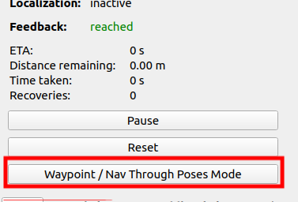

1.下载依赖：

```
sudo apt install ros-$ROS_DISTRO-navigation2
sudo apt install ros-$ROS_DISTRO-nav2-bringup
sudo apt install ros-$ROS_DISTRO-robot-localization
```

2.按顺序启动

(1).小车底盘

```
ros2 launch mickrobot_bringup mickrobotx4.launch.py
```

(2).雷达

```
ros2 launch sllidar_ros2 sllidar_a2m7_launch.py
```

(3).IMU

```
ros2 launch mick_imu_node imu_100D2.launch.py
```

(4).TF变换

```
ros2 launch odom_tf odom.launch.py
```

[这里使用的是odom_tf功能包]

(5).EKF

```
ros2 launch robot_localization ekf.launch.py
```

[这里使用的是官方的robot_localization包]

(6).nav_bringup

```
ros2 launch nav2_bringup bringup_launch.py use_sim_time:=False autostart:=False map:=/home/mickrobot/ros2_ws/src/navigation2/maps/map_out.yaml
```

[这里使用的是官方的navigation2包和nav2_bringup包]

[tips：需要根据自身文件路径修改map.yaml文件的路径，这个yaml文件则是之前建图保存后的yaml文件]

(7).最后启动Rviz2

```
rviz2 -d /home/mickrobot/ros2_ws/src/navigation2/rviz/navigation2.rviz
```

[这里的是rviz2的配置文件的路径，也可以打开rviz2后手动打开]

然后我们可以看到：


然后我们启动navigation2：


然后rviz2上就能出现map，这里的地图就是之前建图建好的地图


接着我们可以使用 2D Pose Estimate 来为小车规划初始点：


再使用Nav2 Goal来设置目标点即可实现单点导航：


演示：


后面是多点导航，我们可以使用navigation2集成的waypoint来实现：

首先，



接着，仍然使用Nav2 Goal来设置多个目标点


然后使用Start Waypoint Following来启动


演示：


这样就成功实现了多点导航


此外，我们还可以使用脚本来启动

```
bash mick_nav2.sh
```
不过使用脚本需要修改其中的部分语句
